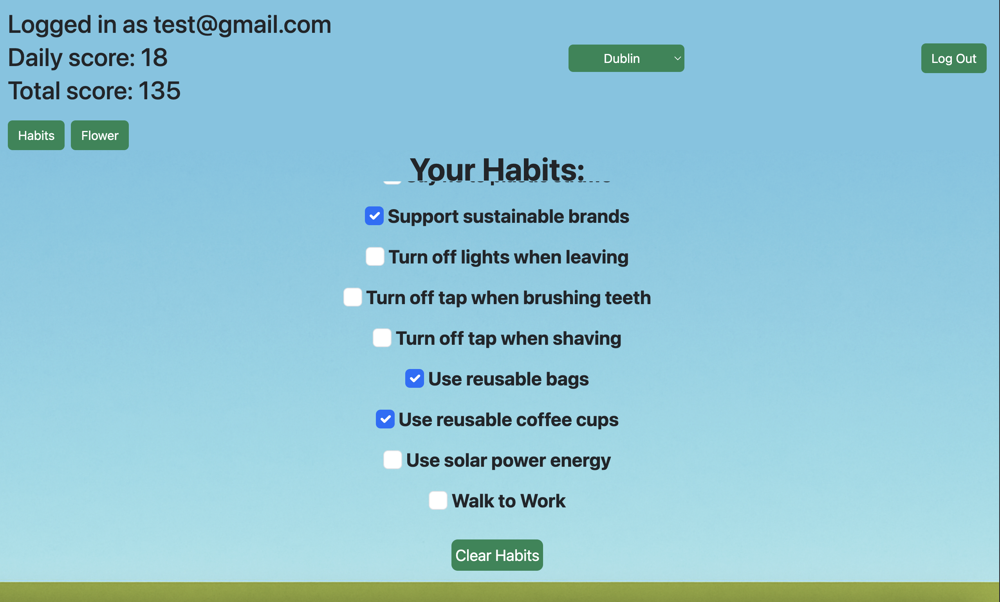
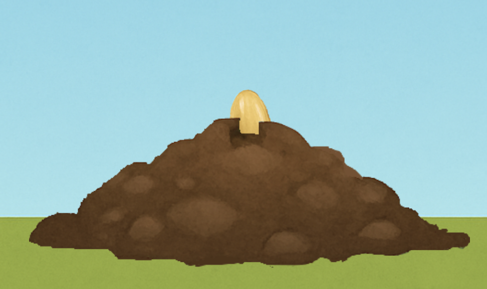
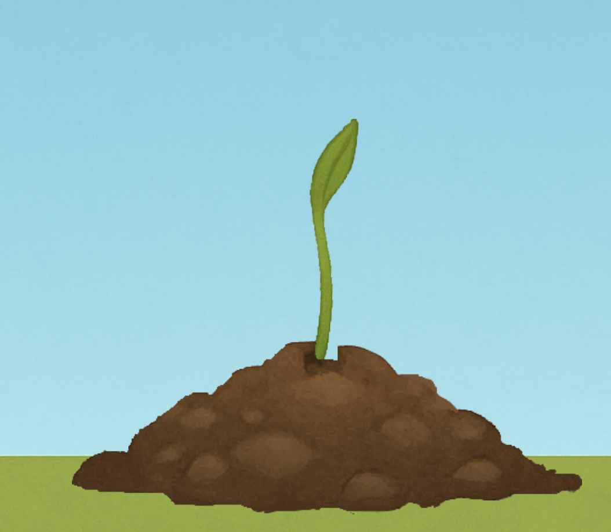
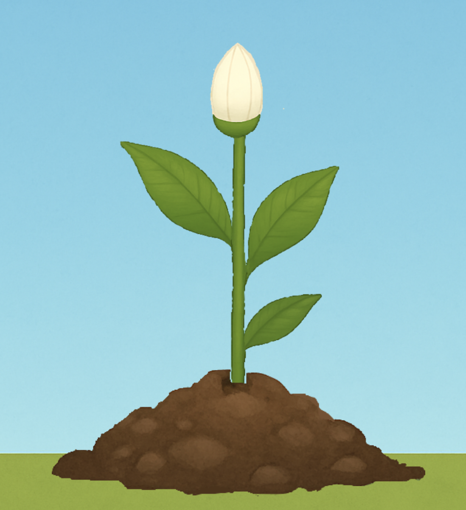

## Sustainability Habit Tracker

A React-based sustainability habit tracking application that allows users to
track daily eco-friendly habits, calculate scores, and visualise progress
through an animated plant growth system.

### Habit Tracking

### Progress Visualisation

## Tech Stack
- React
- Firebase Authentication
- Firestore
- Bootstrap
- CSS animations

## My Role
This was a group project completed as part assessment of our Mobile Application Developement module.

My contributions included:
- Core React application architecture
- Habit tracking and scoring logic
- Firestore data modelling and persistence
- Animated plant growth visualisation
- UI styling and layout
- Routing and state management

## Features
- User authentication using Firebase Auth
- Daily sustainability habit tracking
- Automatic daily score calculation
- Persistent user data stored in Firestore
- Animated visual feedback based on user progress
- Responsive UI design

## Running Locally
1. Clone the repository
2. Install dependencies:
   npm install
3. Ensure Firebase configuration is present in `firebase.js`
4. Start the development server:
   npm start

## Notes
This repository is a fork of the original group project submission.
It is used here to showcase my personal contributions and implementation work.

## Weather API
This project integrates the OpenWeatherMap API for environmental effects.
For security reasons, the API key has been removed from the repository.
To enable weather features, create a .env file and provide your own OpenWeatherMap API key.